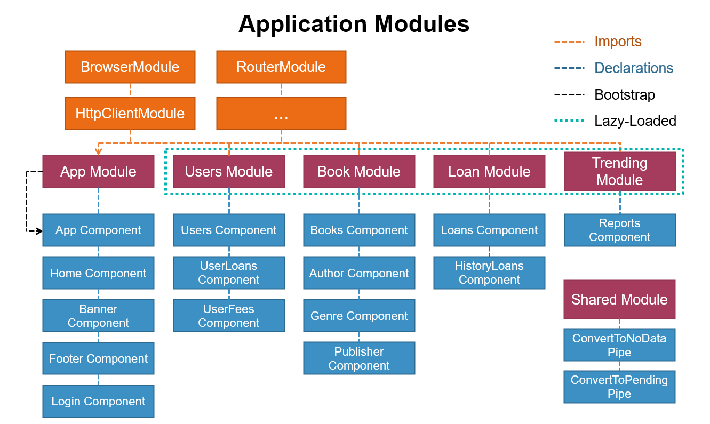
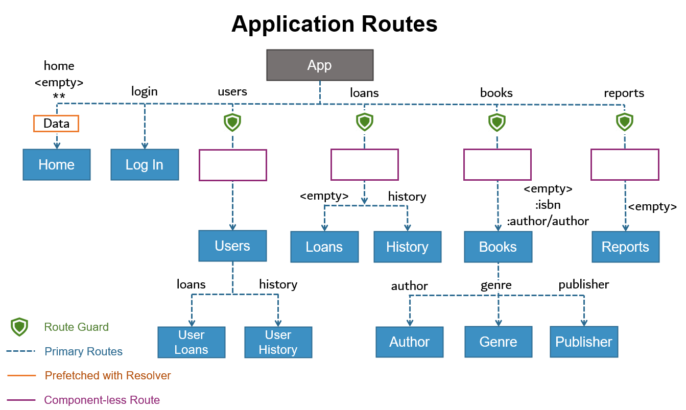

# Library Management App
* This is a Full-Stack Web Application developed with Angular and PHP to manage a library. It has two interfaces that work for two different sets of users: 'User' and 'Administrator'.

* With the 'User' interface, users can request books from the library and check their loan and fee history.

* Using the 'Administrator' interface, library admins can manage the library users, books database and also review and approve the user's book request, deliver and return.

Check the live version here: https://minghsiehlo.github.io/Library-Management-App/

If you want to check out the website without creating an account please feel free to use these credentials:

* User Interface:
> email: user@user.com
> pass: user

* User Interface:
> email: admin@admin.com
> pass: admin

## General info
**App structure and modules:** The app contains one root Angular module with the basic app components and several feature modules with its related components. With this kind of structure, the app can be easily lazy loaded to improve the perfomance. In this app, some feature modules are lazy-loaded while others are preloaded in the background.

**App routes/routing:** Some awesome Angular routing features are implemented in this project: An auth-guard service was implemented to restrict access to some feature modules for unlogged users, the home page data is prefetched with a resolver service and in the routing module, there are component-less routes that helps the application lazy-loading.

**App back-end communication:** The communication with the server-side was established using the built-in Angular HTTPClientModule and the asynchronous code was successfully handled with RxJS observables and JavaScript promises. Also, two HTTP request interceptor was used: one to add headers to every HTTP requests and to cache request information to avoid repetitive HTTP 'GET' requests. 

**App forms:** Angular provides two different approaches to handle user input through forms: reactive and template-driven.  It is not suggested to use both types of forms in a single application, however, in this app, the two approaches were implemented for testing/learning purposes.

## Technologies
* Angular - version 9.1.12
* TypeScript - version 3.8.3
* RxJS - version 6.5.4
* Font Awesome - version 5.14.0
* Bootstrap - version 4.5.2
* Jquery - version 3.5.1
* Ng-Bootstrap - version 6.2.0
* Chart.js - version 2.9.3
* PHP - version 7.2.31
* MySQL - version 5.0.12

## Setup
* Run `npm install` to install all the application dependencies.
* Run `ng serve` for a dev server. Navigate to `http://localhost:4200/`.

## Contact
Created by [@MingHsieh](https://www.linkedin.com/in/ming-hsieh-lo/) - feel free to contact me!
